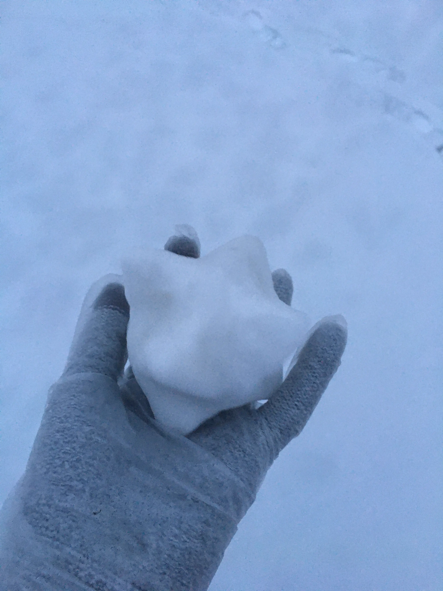

+++
title = "Sojourner's Diary-9"
date = 2023-12-13T12:00:00-05:00
draft = false
categories = ["Sojourner's Diary"]
tags = ["Chengde"]
+++

Although I have relatives from the North, I am a Southerner to my core; and being a Southerner means—having an obsession with snow.

So, when I saw it snowing outside, my heart leaped with an innate excitement.

Regardless, I still had to bundle up in layers upon layers before heading out. Grandma, considering that my brother and I would basically be having "intimate contact" with the snow, specially put a pair of disposable gloves over our regular gloves—this later proved to be a brilliant move.

Snow in the North is different from snow in Hangzhou. Just as winter in Hangzhou is damp and cold, Hangzhou's "snow" is essentially ice: this is reflected in how easy it is to pack into snowballs. Under the dry cold of the North, packing a snowball is not as easy. In other words, Northern snow feels more like a gas than a solid.

So when I painstakingly gathered enough to make a large snowball, I couldn't bring myself to throw it at anyone. Instead, I just found some twigs and made a little snowman right there. After that, what else is there to do on a snowy day?

Ice skating! Well, we didn't have ice skates. But that didn't stop us from walking onto the ice. The river had long since frozen over and was covered with a thick white carpet, with the faint footprints of those who came before. Stepping into this sea of white, my heart seemed to find peace.

What a world this is! Snowflakes fall slowly, weaving a grand melody in the sky. Gathering a handful of snow in this whiteness and tossing it into the air, I was instantly covered in white. Immersed in it, I personally experienced the power of the Creator; this is the world's greatest artistic masterpiece.

Amidst the wonder, I casually shaped a simple geometric form out of the snow. My honest thought was: hurry up and take a picture to show off, and take the opportunity to gloat a bit in front of my Southern friends. Classic me.

