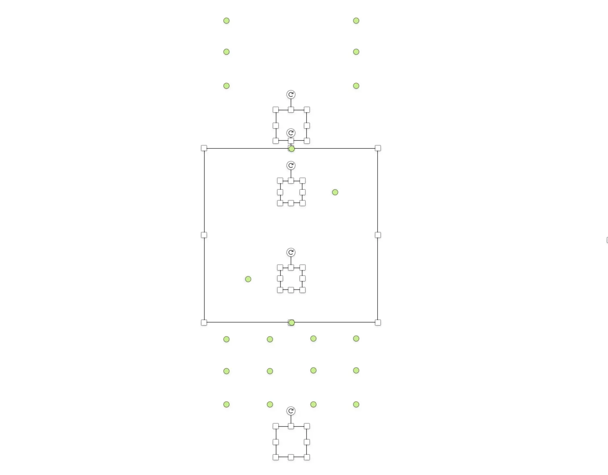

+++
title = "寄居者的日记-65"
date = 2025-03-22T12:00:00-05:00
draft = false
categories = ["寄居者的日记"]
tags = ["北京"]
+++

我希望我的日记中，最核心的也是story。但是当我用心写的story被说看不懂时，难免会有失落吧。

今天和弟兄姐妹去了奥森公园玩飞盘，大家都特别好相处，还有飞盘好玩！

顺路去找了几个宝，结果发现那个地点不偏不倚地落在了灌溉器的工作范围之内。在与其斗智斗勇（指绕着转）了几回合后，喜提沾满泥巴的脏鞋一双。

吃中饭吃到一半，一看时间发现下午到谜协例会要开始了，于是匆忙离开。

然而还是迟到了10分钟，这里就把笔记贴一下吧：

---

## 谜题工坊：从谜色星期五到出题人
1. 题是如何出出来的？
- 例题：展示框
原版与终稿的区别，可能冗余的信息（一眼键盘），以及小时谜的改良
- 例题：计数法
原题是用数字表示笔画数，圈同时暗示了最大笔画数（也美观了不少！）
修改流程：用emoji表示？数字转化圆圈？

2. 一道谜题的进化
- 例题：剪切墙纸
- 最早雏形：水滴形的提示，不同纹理分别指向葵花籽与巴旦木
- 思路：同样的形状，不同纹理带来不同纹理（咚咚谜也用过这样的思路）
- 改进：更加常见的图形（扇形），然后发现巧合：路障又名雪糕筒
潜在的一些问题，以及可能的remix

3. 盲人摸象的诞生
- 灵感来源：logitech的标识
画出来像是扩音器？竖着看像是灯？
- 名称的变化：direction-views
col老师对于改进的建议，通过字的朝向暗示视角
- 谜题工坊：半成品谜题
利用全选之后的框出题，保证可做性

---

我也出了一道题！有兴趣的可以尝试做做？提示：和中国古代文化相关

    
🔍 点击查看谜题提示/答案

    **提示：** 观察可得此谜题与中国古典文化中的“八卦”有关。
    
    - 卦象：☰ (乾)、☷ (坤)
    - 思路：将卦象名称对应文字尝试组词，可以得到唯一有意义词组：**“乾坤”**。

