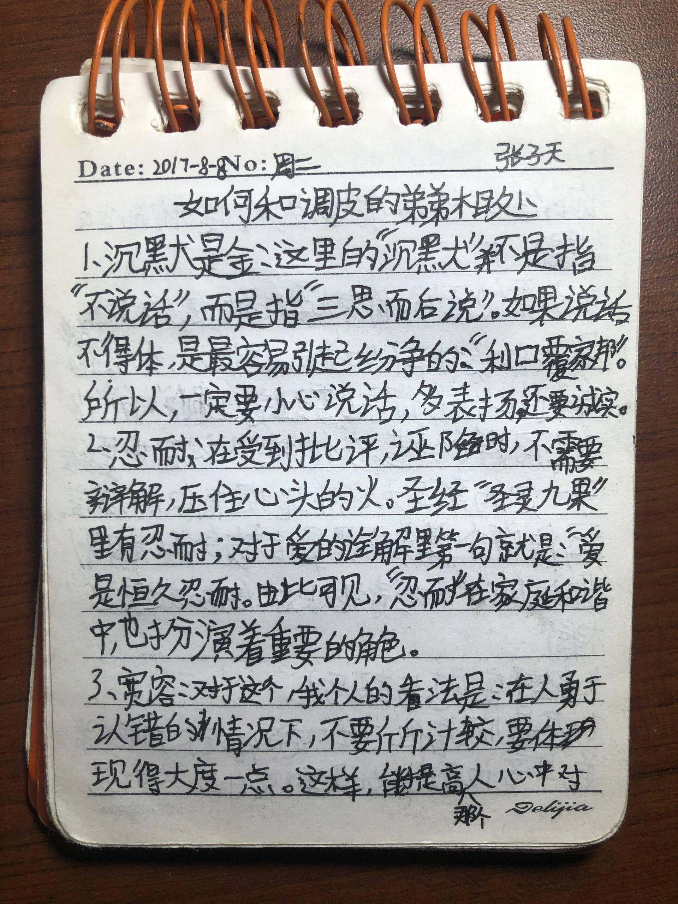
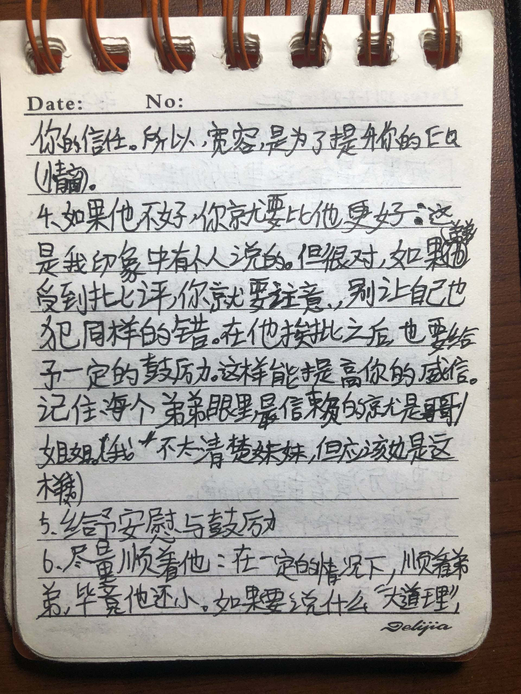
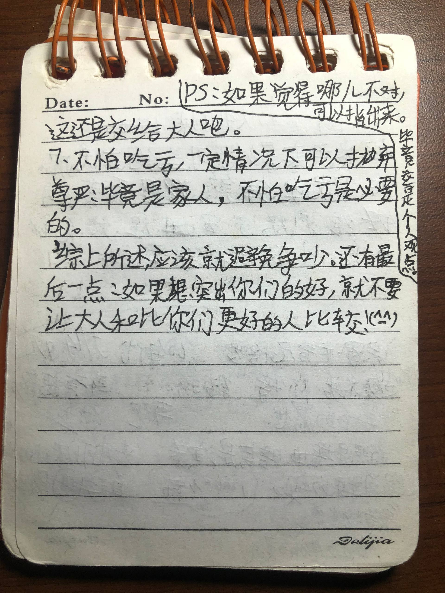

+++
title = "寄居者的日记-131"
date = 2026-04-22T12:00:00-05:00
draft = false
categories = ["寄居者的日记"]
tags = ["朗维尤"]
+++

今天收拾东西的时候，翻到了小时候写的一个小本本

稚嫩的字迹写就的姓名，封面上是荧光笔打底的”403“，铅笔涂成的”503“以及圆珠笔最后刻下的”603“。里面的内容则大多是草稿和一些写着玩的东西，也不乏MC群系列表，房屋设计图（对当时我一个一个方块画出来的），甚至还有小时候画到一半的漫画。其中更有一些内容颇具后来《无聊的笔记》之雏形，可谓老资历

这其中，有一些内容尤其吸引我：

这个“调皮的弟弟”是谁呢？好难猜啊（

我老家的弟弟——因为属虎我们都叫他“大猫”，下文就这么叫吧——是个比我小4岁的孩子。小时候，每次回老家都能和他打成一片（物理）。用我妈在已经看不到的某篇发在“恩典之路”公众号上的文章的话来讲，俩“人嫌狗不待见”的娃散是满天星，聚则魔丸降世。当然也可能是小时候我天资聪颖，干出的缺德事包括但不限于出门大街上找陌生人借钱，把晾衣服的夹子夹在猫尾巴上看它幻影旋转，在亲戚拜访高高兴兴带我们出门买玩具时哭着回到家，发掘出不止一条翻越封锁校园大门的路径致使校方对其一再加高（这么说来，当时我好像还有个外号，叫什么“张三疯”来着？哎我当时怎么就没看过《倚天屠龙记》呢）。当然这些事你从不会听人提起，因为它们大多都被尘封在了老家的那个角落，随着在那度过的童年一并消逝

做哥哥的都如此身先士卒了，那弟弟必将不遑多让。在我的记忆里，长辈对我们的要求一度妥协至：你们只要一周不吵架我就带你们去买玩具，可见当时我俩有多不让人省心。但也正是在这样的欢乐之中，我们度过了那段无忧无虑的童年时期。

小时候我就特别喜欢看奥特曼，尤其是16年在电视上追完欧布的那段时间，被这田口超人搞出来的奥棚50周年纪念作迷得不要不要的（什么今年60周年吗？我祝他好运吧）。主角红凯那股子浪人的属性尤其令我向往，于是那段时间我们角色扮演的主题自然而然就变成了奥特曼打怪兽，基地那必然是我们睡的上下铺。然而，主角始终只有一个而我们有两个人，怎么办呢？

搞OC不就行了！

没想到，当时小小的老子就已经有此见识，深得“同人的尽头是OC“这一至高定理。主角的名字我其实都没花心思，在一看到”红凯“时我就想好了他的3个队友的名字：蓝杰、黑寇和白赞（笑点解析：乐高史上最耐活的IP幻影忍者和他花花绿绿的主角团）。可是奥的名字这块着实令我犯了难，在此，请允许我犯个二，谨以还原历史真相为由在此心怀敬畏地写下那闪耀的，新创华这辈子无法企及的名字：欧布（这是原版）、欧迪、基罗、戴斯

这不就是缝合怪嘛！

在见识过了这位小小的同人创作者堪忧的起名能力之后，想必各位也能理解开头这一串战绩可查确实是他做得出来的事。那接下来，让我们以红凯的视角继续这段童年

尽管黑寇和白赞（你能别念叨你那奇葩名字了不）并没有实体，红凯（我弟饰）和蓝杰（自然是我饰）踏上了他们惊心动魄的宇宙之旅。他们一路披荆斩棘，击败了许多邪恶的怪兽，不止一次地拯救了世界（尽管剧情似乎与他们当时看的影视作品多有雷同，但这不重要）。可不知是哪一天，蓝杰突然变了，他变得不再热衷于拉着战友踏上旅途，而是一到基地便倒头就睡，徒留红凯一人继续这冒险。再后来，他开始花更多的时间对着一块小小的屏幕点来点去，里面的世界却看起来大得多，虽然都是马赛克。凯不知道为什么哥哥变了，但不希望他这样变。于是，他想尽办法吸引哥哥的注意，哪怕那些模仿看似笨拙与讨厌

比如，哥哥在玩我的世界，那弟弟就照着开始玩……迷你世界？这发展不对吧？我记得这似乎是百度上吵的最火的一段，被后人称为“一战”的时期啊。好吧你赢了，你的品味独特又小众。在忍受了很长一段时间电视被抢整天放迷你实况的时间，某人终于良心发现金盆洗手，我们快乐地在MC中继续着我们的冒险，搭起了大房子和农田，虽然没有前往宇宙与怪兽搏斗也没有拯救世界，但那确实是很快乐的一段联机时间

疫情爆发之后，我回去的时间，也越来越少了。

当然故事没有在这里结束，只是换了一种形式。我除了打游戏之外，也是会在每天睡前给弟弟讲上一段故事的。每到那个时候，长辈手机里播放的”世界名曲+经典故事 慧慧阿姨讲故事“频道就会暂停。我们会短暂地进入Jason的MC世界，看着他如何一步一步成长，最终再一次替我们拯救世界

这样的睡前故事时间似乎成了二人之间约定俗成的习惯。当然，这位稍微长大了一点的创作者的作品依旧有着极高的查重率，和另一部小说——《斗罗大陆》的相似之处尤为明显。可谓缝得不知天高地厚了

对了，当时我偶尔不讲故事的晚上，就会在被窝里的kindle上看《绝世唐门》和《龙王传说》的小说，这样的习惯延续到了初中，但《终极斗罗》的后半段真看不下去了，故弃坑

他最终当然还是发现了这一“原作”的存在，于是果断二创转一创，和我一起看起了斗罗的漫画。有一段时间，我每次回去都能看到满屋的实体漫。尽管我的习惯是线上看漫画，看见这一床花花绿绿也会为之动容。小时候买玩具的钱，长大后变成了买漫画的钱，原来你一直与我同在！

事到如今，早已长大的两人早已很难再吵起架来。但奇怪的是，他们之间的交流也逐渐少了起来。我偶尔听说弟弟一直盼着我回去，每次回去的时候他又总是躲着我，为此没有少被长辈说过。而我，每次回去总是窝在自己的房间里，灯是亮到半夜的，人是第二天中饭才见到的。再加上二人放假的时间总是错开，我们似乎渐行渐远

我有时也会去想，有没有可能，是我在不自觉地躲着他？虽然在文章里写道不要比较，我却总是将他与另一个比我小7岁的家伙对比。早期二人平分秋色，一般是和红玫瑰在一起时就觉得白玫瑰好，反之亦然。但大概是他开始有意识地和我对着干的时候开始，也可能是那个更年轻的还没进青春期的缘故，天平往某一边猛然倾斜了。我似乎也不再向往着假期回老家的时间

但其实，我是知道的，我是明白的。我是他唯一的哥哥啊，他怎么可能会讨厌我呢？大猫的家庭是复杂的，在此不应过多涉及，但这个从小失去亲生母亲的孩子身上确实背负了一些难以想象的东西。我一向不认可心理学上指责原生家庭的做法，但不可否认，后者在人的一生中的确会起到举足轻重的作用。我是幸运的，但并不是所有人都像我

于是我在最后一次不足一周归乡的时光里，终于迈出了一步。我们加上了微信和QQ，并约定不管谁先发消息都要尽可能第一时间回复。“如果遇到什么难处，就来找哥哥吧。”我说完这句话，就踏上了漫长的旅途

如果一部小说的情节里出现了枪，那必然有一幕它会开火。说到这，相信你也能想到，我们如今仍然通过微信保持着联系。实际上，这篇文章就是在我疯狂星期四V他50后才得到授权得以写就的。前几天的聊天里，不知怎的就聊到了《绝世唐门》。我们默契地“只想大声的宣言”、“唐门永远流传”，仿佛能看到屏幕对面熟悉的笑容。没想到每次回去说不上几句话的我和他如今在微信上已经开始互相推视频了。网络，很神奇吧

这时再回看17年小小的老子写的《如何和调皮的弟弟相处》，也终于释怀地笑了。原来，我们同样笨拙