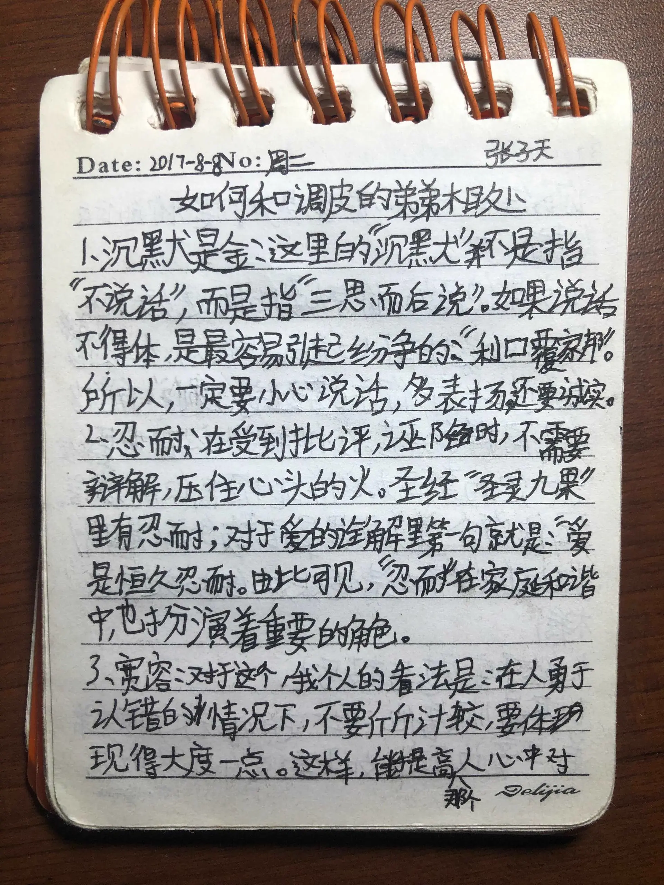
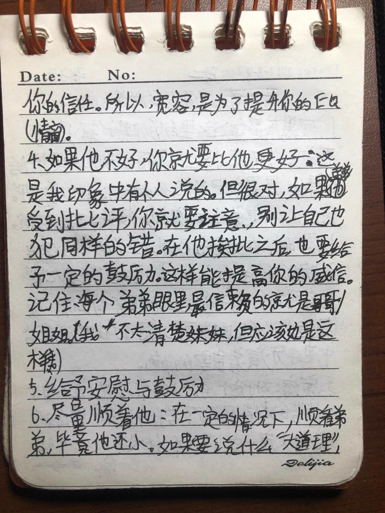
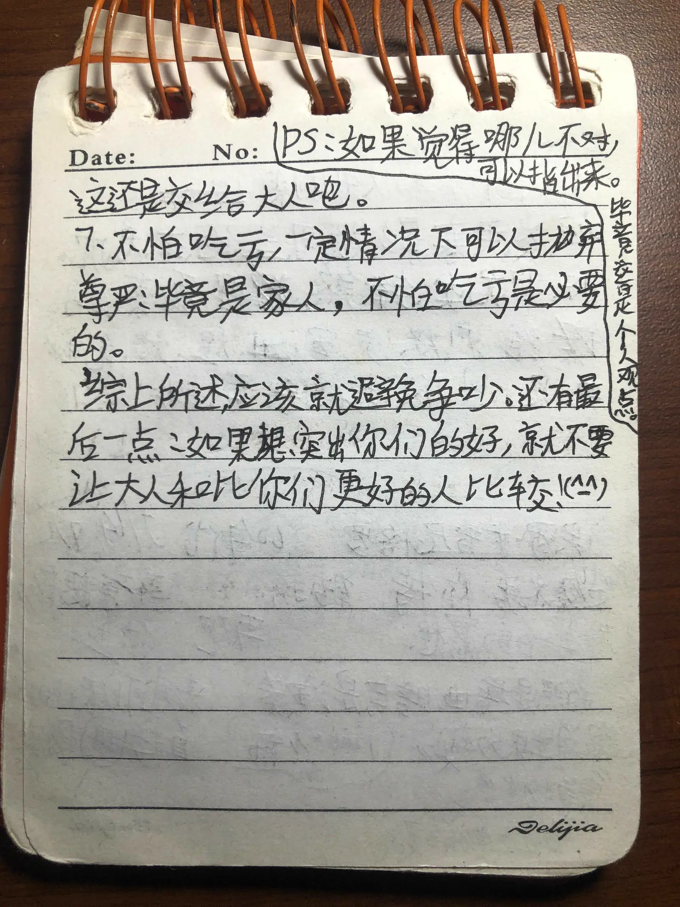

+++
title = "Sojourner's Diary - 131"
date = 2026-05-05T12:00:00-05:00
draft = false
categories = ["Sojourner's Diary"]
tags = ["Longview"]
+++

While packing today, I found a little notebook I had written in as a child.

My name appears in an immature hand. On the cover, “403” sits over a fluorescent-highlighter background, “503” is shaded in pencil, and “603” was finally carved in ballpoint pen. Most of the pages contain drafts and bits of writing made for fun. There is also no shortage of Minecraft group rosters, house designs—yes, I drew them one block at a time—and even a comic abandoned halfway through. Some passages distinctly foreshadow the later *Boring Notes*, making this notebook a true veteran.

A few pages caught my attention in particular:

Who could this “mischievous younger brother” possibly be? What a difficult mystery. (

My younger brother back in our hometown—because he was born in the Year of the Tiger, we all call him “Big Cat,” and I will do the same below—is four years younger than I am. Whenever I returned home as a child, the two of us immediately became inseparable. Sometimes physically, in the fighting sense.

To borrow Mom's words from an article once published on the now-inaccessible *Path of Grace* account, the two little monsters “unwelcome even by dogs” became stars scattered across the sky when separated and the incarnation of a demon when brought together. Of course, perhaps I was simply a gifted child. My brilliant deeds included, but were not limited to, asking strangers on the street to lend me money; clipping a clothespin to a cat's tail to watch it spin like a phantom; returning home in tears after relatives happily took us out to buy toys; and discovering more than one route over the locked school gate, forcing the school to raise it again and again.

Come to think of it, I had a nickname then. Something like “Zhang Sanfeng the Mad”? Why had I not even watched *The Heaven Sword and Dragon Saber* at the time?

Naturally, nobody ever tells these stories now. Most were sealed away in that corner of our hometown and faded together with the childhood I spent there.

With the older brother charging so heroically ahead, the younger one could hardly fall behind. At one point, the adults lowered their expectations to: “If you can go one week without fighting, I will take you to buy toys.” That should indicate how impossible the two of us were. Yet amid all that joy, we passed through a carefree childhood together.

I especially loved Ultraman as a child. In 2016, I followed *Ultraman Orb* on television all the way to the end and became utterly enchanted by Taguchi's fiftieth-anniversary production. What, this year is already the sixtieth anniversary? I wish it luck. I particularly admired the wandering quality of the protagonist, Gai Kurenai. Naturally, our roleplaying soon became Ultraman fighting monsters, with the bunk beds where we slept serving as our base.

There was one problem: a story has only one protagonist, while there were two of us. What could we do?

Create original characters, obviously!

Who could have imagined that tiny me already understood the supreme law that “all fan creation ends in OCs”? I did not spend much thought on the protagonists' human names. The moment I saw Gai Kurenai's name, I invented three teammates: Blue Jay, Black Cole, and White Zane. The joke, for those requiring an explanation, is *Ninjago*, LEGO's most indestructible franchise, and its brightly colored cast.

Naming the Ultramen themselves proved considerably harder. At this point, please allow me to be stupid in the name of historical accuracy. With reverence, I record the radiant names that Tsuburaya's New Generation Heroes could never hope to match in this lifetime: Orb—that one is the original—Odi, Giro, and Des.

Those are just stitched-together monstrosities!

Having witnessed this tiny fan creator's alarming gift for names, I trust everyone now believes that the long record of misdeeds above was entirely within his abilities. Let us continue this childhood from Gai Kurenai's point of view.

Although Black Cole and White Zane—could you stop repeating those bizarre names?—never possessed physical bodies, Gai Kurenai, played by my brother, and Blue Jay, naturally played by me, set off on their thrilling journey through space. They fought through every obstacle, defeated countless evil monsters, and saved the world more than once. The plots may have resembled whatever films and television shows they were watching at the time, but that is unimportant.

Then, on some unknown day, Blue Jay changed. He no longer eagerly dragged his comrade out on another journey. Whenever he reached the base, he simply collapsed into sleep, leaving Gai Kurenai to continue the adventure alone. Later still, he spent more and more time tapping a tiny screen. The world inside it looked much larger, though everything was made of pixels.

Gai did not understand why his older brother had changed, but he did not want him to change this way. So he tried everything he could to attract his brother's attention, even when his imitations seemed clumsy and annoying.

For example, when the older brother played Minecraft, the younger brother copied him by playing... *Mini World*? Wait, that is not how this plot is supposed to develop. If memory serves, this was the fiercest phase of the argument on Baidu, later known to historians as “the First World War.” Fine, you win. Your taste was distinctive and niche.

After enduring a long period in which he monopolized the television to play *Mini World* videos all day, a certain person finally rediscovered his conscience and abandoned the habit. We happily continued our adventures together in Minecraft, building a large house and farmland. We did not travel into space, fight monsters, or save the world, but it was still a genuinely happy period of playing together.

After the pandemic began, I returned home less and less often.

The story did not end there, of course. It only changed form. In addition to playing games, I told my brother a story every night before bed. When the time came, the “World-Famous Music and Classic Stories: Aunt Huihui Tells Stories” channel playing from an adult's phone would pause. For a little while, we entered Jason's Minecraft world and watched him grow step by step, until he once again saved the world for us.

These bedtime stories became an unspoken ritual between us. Naturally, the works of this slightly older creator still had an extraordinarily high similarity score. Their resemblance to another novel, *Soul Land*, was particularly striking. Truly, I stitched with no respect for heaven or earth.

On nights when I occasionally did not tell a story, I would hide under the blankets reading *The Unrivaled Tang Sect* and *The Legend of the Dragon King* on my Kindle. The habit continued into middle school, though I genuinely could not endure the second half of *Ultimate Douluo*, so I abandoned it.

My brother eventually discovered the existence of this “source material.” He promptly converted my fan work back into the original and began reading the *Soul Land* comics with me. For a while, every visit home revealed physical comic books spread throughout the room. I usually read comics online, but even I was moved by that bed full of bright colors. The money we spent on toys as children had become money for comics as we grew older. So you had been with me all along!

By now, the two of us have long since grown up and rarely argue anymore. Strangely, however, we also began communicating less and less. I would occasionally hear that my brother was constantly looking forward to my return, yet whenever I arrived, he always hid from me and received no shortage of lectures from the adults for it.

As for me, every time I returned, I shut myself in my own room. The light remained on until late at night, and nobody saw me until lunch the next day. Our school vacations also seemed perpetually misaligned. We appeared to be drifting farther apart.

Sometimes I wonder whether I was unconsciously hiding from him too. Although I wrote in that childhood notebook that one should not compare people, I constantly compared him with another boy seven years younger than I am. Early on, the two were evenly matched. It was the usual red-rose, white-rose problem: when I was with one, the other seemed better, and vice versa. But perhaps when Big Cat began deliberately opposing everything I did—or perhaps simply because the younger child had not yet reached adolescence—the scales suddenly tipped hard to one side. I no longer seemed to look forward to holidays in our hometown.

But in truth, I know. I understand.

I am his only older brother. How could he possibly hate me?

Big Cat's family circumstances are complicated and do not belong in detail here, but a child who lost his biological mother at a young age truly carries burdens difficult to imagine. I have never agreed with the tendency in psychology to blame everything on one's family of origin. Yet it cannot be denied that family plays an enormous role throughout a person's life. I am fortunate. Not everyone is as fortunate as I am.

And so, during my final visit home, which lasted less than a week, I finally took a step forward. We added each other on WeChat and QQ and agreed that, no matter who sent a message first, the other would reply as soon as possible.

“If anything becomes difficult, come to your brother,” I said.

Then I set out on my long journey.

If a gun appears in a novel, it must fire in some later scene. By this point, you can probably guess that we still keep in touch through WeChat. In fact, this article received authorization only after I sent him fifty yuan for Crazy Thursday at KFC.

A few days ago, our conversation somehow turned to *The Unrivaled Tang Sect*. In perfect agreement, we proclaimed, “I only want to declare it aloud,” and “The Tang Sect shall endure forever,” as though I could see that familiar smile on the other side of the screen. The two of us who could barely exchange a few sentences whenever I returned home now recommend videos to each other on WeChat.

The internet is miraculous, is it not?

When I look back now at *How to Get Along with a Mischievous Younger Brother*, written by tiny me in 2017, I can finally smile in relief.

It turns out we were equally clumsy.
